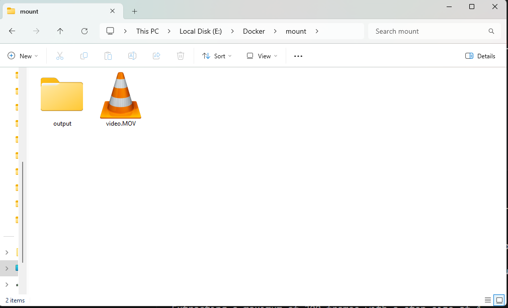

# VideoToGaussianSplat

Use Docker to take a video file (like from your iPhone) and convert it into a Gaussian Splat scene.

This is a work in progress; at this time all it does is convert a movie file into static images that can be trained to make a gaussian splat scene using the `convert.py` file.
The complete directions for creating the Gaussian Splat scene can be found [here](https://github.com/graphdeco-inria/gaussian-splatting)


## Building the Docker image

Clone this repo and build the Dockerfile inside to get started.

```bash
git clone git@github.com:DavidAtRedpine/VideoToGaussianSplat.git && cd VideoToGaussianSplat
docker build -t video-to-gaissoam-splat:latest .
```

## Running the Docker container

The container expects a video file and an output folder to convert it to frame images. Here's how I run the script. I have a "video.MOV" file in `e:\Docker\mount`. and put the frame images into `e:\Docker\mount\output`.

```bash
docker run -v /e/Docker/mount/video.MOV:/app/video.MOV -v /e/Docker/mount/output:/app/output video-to-gaissoam-splat /app/video.MOV
```

## Result

Once the Docker container is finished running, you should have a series of images that you can use in the gaussian splat `convert.py` for making your scene.

<div style="text-align: center;">
    
</div>


